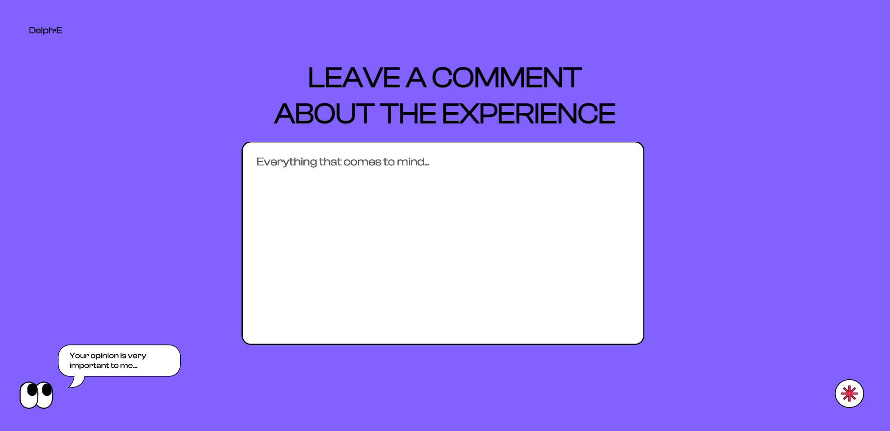
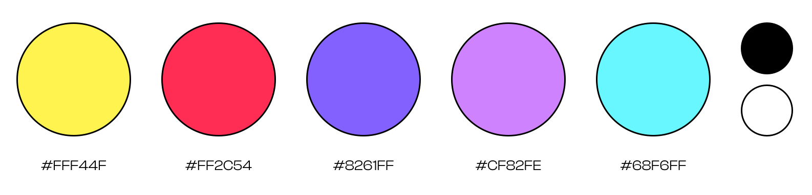

# Delph⋅E

Delph⋅E is a virtual space that aims to make tangible the presence of technology and profiling algorithms in everyday life. Every time a user surfs the Internet, he unknowingly leaves behind a trail of data. This data is collected and exploited by profiling algorithms to 'know' the user and return 'tailored' recommendations, showing only what the user might like.

## 1. [THE PROJECT](#the-project)

### a. Theme: the presence 

### b. Concept 

### c. Context of use 

### d. The structure 

## 2. [DESIGN CHALLENGES](#Design-Challenges)

### a. Design System

## 3. [CODING CHALLENGES](#Coding-Challenges)

### a. Face recognition

### b. Voice Synthesizer 

### c. Parameter transmission 

### d. Text By input 

## 4. [REFERENCES](#References)

### a. Libraries

### b. References and tutorials

## 5. [CREDITS](#Credits)


# THE PROJECT


**THEME: THE PRESENCE**

*"Is there a usage of technology that makes it **present, tangible, persistent**?"*

We imagined technology as being an ever-vigilant entity. Always present. With an eye constantly on the user. It monitors our activities so as to classify and assimilate them into larger patterns.
It collects endless amounts of data about our actions and movements by studying them to the point of being able to predict them. 

So, the question is: "Are the algorithms the **new crystal ball or even the 21st Century Oracle of Delphi?**"

Profiling algorithms tend to to draw stereotypical profiles to which they propose sometimes inaccurate recommendations.
Users are not always aware of the ways in which the network collects their data to exploit it in profiling processes. 

The goal of our project is to make the profiling algorithm very tangible, raw, and coarse, highlighting the moment it collects data and translates it into recommendations.


**CONCEPT**

<!--Immagine concept-->

Delph⋅E replicates this experience, making it intentionally coarse and stereotypical. Through some explicit technologies such facial expression recognition, the website collects user’s emotions and reactions to certain content to extort his preferences and make a series of decisions about him. The profilation uses also some implicit datas, that the user is not aware  he is giving during the experience such as the time spent watching the gifs. The result is the flattening of the user, associated with a false and stereotypical identity model.

The name "Delph⋅E" comes from the algorithms' ambition not only to know everything about the world but to know everything about yourself.  The most famous  Delphic maxim in the Ancient Greek was indeed "know thyself".


**CONTEXT OF USE**

The project was conceived for the context of an exhibition.

In the exhibition, to make the experience more immersive we thought to have a single screen with a keyboard and a mouse surrounded by multiple stereos to attract the attention of people passing by. When nobody is doing the experience at the monitor, the voice of the algorithm will call for the passers-by's attention until they click and start the experience.


**STRUCTURE**

**Home**
The user is welcomed and attracted to join the expirience. 


**Name**
The algorithm kindly asks the user's name. This will the only information that the user willingly provides to the website. 


**Face Recognition**
The algorithm will analyze the user's gender, age and emotions through the webcam. The user knows that these informations are explicitly taken by the algorithm, but she/he don't know for what purpose they will be used.  

**Loading**
In this part, while the user's waiting for the loading to end, the website will take the implicit information about her/his behaviours: if the user remains still and doesn't interact with the website then the algorithm will consider he/she as a "chill person", otherwise the user will appear nevrotic. 


**Reacting to GIFs**
In this part the website shows four GIFs. The GIFs shown were chosen because they touch on generic but very polarising topics. From the time spent on each input, it will be possible to draw a complete user profile based on classic stereotypes. This will be another implicit information taken into account. 

**Report**
The website will give a coarse report about the user's profile.  

**Recommendations**
In the end, the algorith will do what every profiling algorithm does: to give recommendations. 
The recommendations given are extreme, in some cases violent. This is to make the user feel touched by the process as the algorithm gives them recommendations that they would never actually consider, because they take their reactions to extremes.


**Review**
At the end, the website will let the user leave a comment about the whole experience, but the algorithm thinks it knows the user better than the user himself, so it can anticipate and force his opinions.


# DESIGN CHALLENGES

In order to answer the question of the presence of technology, instead of choosing a more aggressive approach that imposes itself on the user's decisions, we wanted to work on the concept of explicit and implicit information that the user surrenders to the profiling algorithm.

The challenge was to make the feeling of constant vigilance without making it overly disturbing and intimidating.
Therefore, we chose to create a site with friendlier dynamics, with the site trying to constantly maintain a contact and relationship with the user.

The site's interface with its playful, friendly and appealing aesthetics has been created in this way as it masks and completely hides the omnipresent and sometimes disturbing logic of the profiling algorithm. In fact, the moving eyes are the only element that could remind us how a seemingly friendly detail hides behind the fact that we are constantly being followed.


**DESIGN SYSTEM**




# CODING CHALLANGES

**FACE RECOGNITION**

For the first part of the project, where the camera is on and it starts to take your information, we initially thought of using Face.api on ml5, but we saw that age and gender weren't supported. So we decided to use Face.api built on tensorflow.js library for both the age, gender and emotions’ recognition. 

We had a difficult time with the decodification of the code taken from an [Open Source Github Repository](https://github.com/justadudewhohacks/face-api.js#displaying-detection-results) and the modification of the recognition box style, but we managed to edit the style by directly putting hands into the face-api.min.js file 

We added the library source to html:

```JavaScript
 <script src="libraries/face-api.min.js" defer></script>
```

Then we worked on the correlated .js file:
```JavaScript
const video = document.getElementById("video");
```

```JavaScript
Promise.all([
  faceapi.nets.tinyFaceDetector.loadFromUri("./models"),
  faceapi.nets.faceRecognitionNet.loadFromUri("./models"),
  faceapi.nets.faceExpressionNet.loadFromUri("./models"),
  faceapi.nets.ageGenderNet.loadFromUri("./models"),
]).then(startVideo);
```

```JavaScript
function startVideo() {
  navigator.getUserMedia =
    navigator.getUserMedia ||
    navigator.webkitGetUserMedia ||
    navigator.mozGetUserMedia ||
    navigator.msGetUserMedia;

  if (navigator.getUserMedia) {
    navigator.getUserMedia(
      { video: true },
      function (stream) {
        var video = document.querySelector("video");
        video.srcObject = stream;
        video.onloadedmetadata = function (e) {
          video.play();
        };
      },
      function (err) {
        console.log(err.name);
      }
    );
  } else {
    document.body.innerText = "getUserMedia not supported";
    console.log("getUserMedia not supported");
  }
}

video.addEventListener("play", () => {
  const canvas = faceapi.createCanvasFromMedia(video);
  document.body.append(canvas);
  const displaySize = { width: video.width, height: video.height };
  faceapi.matchDimensions(canvas, displaySize);
  setInterval(async () => {
    const predictions = await faceapi
      .detectAllFaces(video, new faceapi.TinyFaceDetectorOptions())
      .withFaceExpressions()
      .withAgeAndGender();

    const resizedDetections = faceapi.resizeResults(predictions, displaySize);
    canvas.getContext("2d").clearRect(0, 0, canvas.width, canvas.height);

    faceapi.draw.drawDetections(canvas, resizedDetections);
    faceapi.draw.drawFaceExpressions(canvas, resizedDetections);

    resizedDetections.forEach((result) => {
      const { age, gender } = result;

      const drawOptions = {
        backgroundColor: "#ffd100",
        fontColor: "#000000",
      };

      new faceapi.draw.DrawTextField(
        [`Age: ${faceapi.round(age, 0)}`, `Gender: ${gender}`],
        result.detection.box.topLeft,
        drawOptions
      ).draw(canvas);
    });
  }, 100);
});
```

To work with the video pistion and box styling we worked on both html file and the face-api.min.js file:
**Html**
```JavaScript
  <style>
 body {
        background: #8261ff;
        overflow: hidden;
        margin: 0;
        padding: 0;
        width: 100vw;
        height: 100vh;
        display: flex;
        justify-content: center;
        align-items: center;
        font-style: normal;
        font-family: "Clash Display 500";
      }

      canvas {
        position: absolute;
      }
  </style>
 </head>
  <body>
    <video
      id="video"
      width="720"
      height="540"
      autoplay
      muted
      style="border: 2px #000 solid; border-radius: 30px"
    ></video>
  </body>
</html>
```

**Face-api.min.js** *(near line 25491)*
```JavaScript
 var Vh = function (t) {
      void 0 === t && (t = {});
      var e = t.anchorPosition,
        n = t.backgroundColor,
        r = t.fontColor,
        o = t.fontSize,
        i = t.fontStyle,
        a = t.padding;
      (this.anchorPosition = e || Bh.TOP_LEFT),
        (this.backgroundColor = n || "#FFD100"),
        (this.fontColor = r || "rgba(0, 0, 0, 1)"),
        (this.fontSize = o || 20),
        (this.fontStyle = i || "Clash Display"),
        (this.padding = a || 4);
    },
```
**VOICE SYNTHESIZER**

In order to give a personality and a voice to the profiling algorithm.  We decided to use the p5.Speech() library, a p5 extension to provide Web Speech (Synthesis and Recognition) API functionality, following the directions given in the GitHub repository: [IDMNYU/p5.js-speech](https://github.com/IDMNYU/p5.js-speech/blob/master/LICENSE). 

After downloading the library, uploading it in the "libraries" folder and including the code in the html file 
```JavaScript
<script src="libraries/p5.speech.min.js"></script>
```

we were able to specify what the user will hear in each page and some parameters, such as voice, rate, pitch and language.
```JavaScript
voice = new p5.Speech();
 voice.onLoad = voiceReady;

function voiceReady() {
  voice.listVoices();
  voice.setVoice("Samantha");
  voice.setRate(1);
  voice.setPitch(1.3);
  voice.setLang("en-US");
  voice.speak(voiceText);
}
```

**PARAMETER TRANSMISSION**

We wanted to pass some information (such as the name and the time spent on each GIF measured in framecounts/60) between pages, and to do so we made it possible to read the parameter we needed from the URL.

```JavaScript
const urlString = window.location.href;
let url = new URL(urlString);
let myType;

[...]

  myType = createInput("").attribute("placeholder", "Don't be shy...");

[...]
function nextPage() {
  window.open(
    "03-Video.html?currentUser=" +
      myType.value() +
      "&AnswerTime=" +
      frameCount / 60,
    "_self"
  );
}
```


**TEXT BY INPUT**

On the final comment page, whatever the user tries to type will be displayed in the same sentence, making explicit the mechanism of the site. Each letter that makes up the final sentence is associated with a numeric value with the keyCount variable, so that at each key pressed, that value (initially 0) increases, showing the correct letter each time.
```JavaScript
keyCount = 0;

function keyTyped() {
  keyCount++;
  console.log(keyCount)

  if (keyCount == 1) {
    content += “L”;
  }

  if (keyCount == 2) {
    content += "O";
  }

  if (keyCount == 3) {
    content += "L. ";
  }
[...]
```

# REFERENCES 

**LIBRARIES**

Face.api from [justadudewhohacks/face-api.js](https://github.com/justadudewhohacks/face-api.js)

[IDMNYU - p5.js-speech](https://github.com/IDMNYU/p5.js-speech)

**REFERENCE AND TUTORIALS**

[Daniel Shiffman - The coding train](https://thecodingtrain.com/)

[W3School](https://www.w3schools.com)

[Stealing you feelings](https://stealingurfeelin.gs/)

# CREDITS
The projects was created for the [Creative Coding 2022/2023](https://drawwithcode.github.io/2020/) course at **Politecnico di Milano**.

**Faculty:** Michele Mauri, Andrea Benedetti, Tommaso Elli.

***Delph⋅E* was developed by:**
Elisabetta Como,
Paola Pia Palumbo,
Benedetta Riccio,
Zeya Wu
